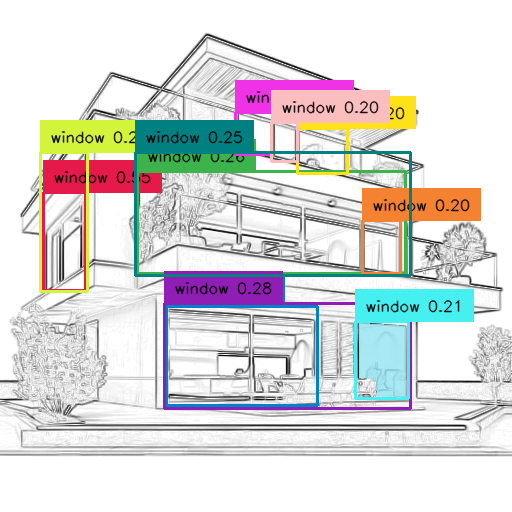
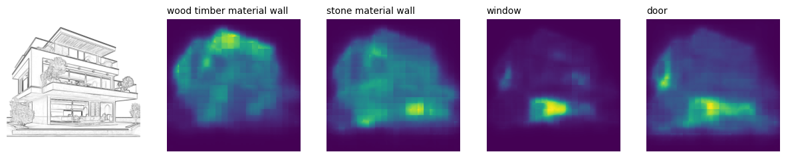
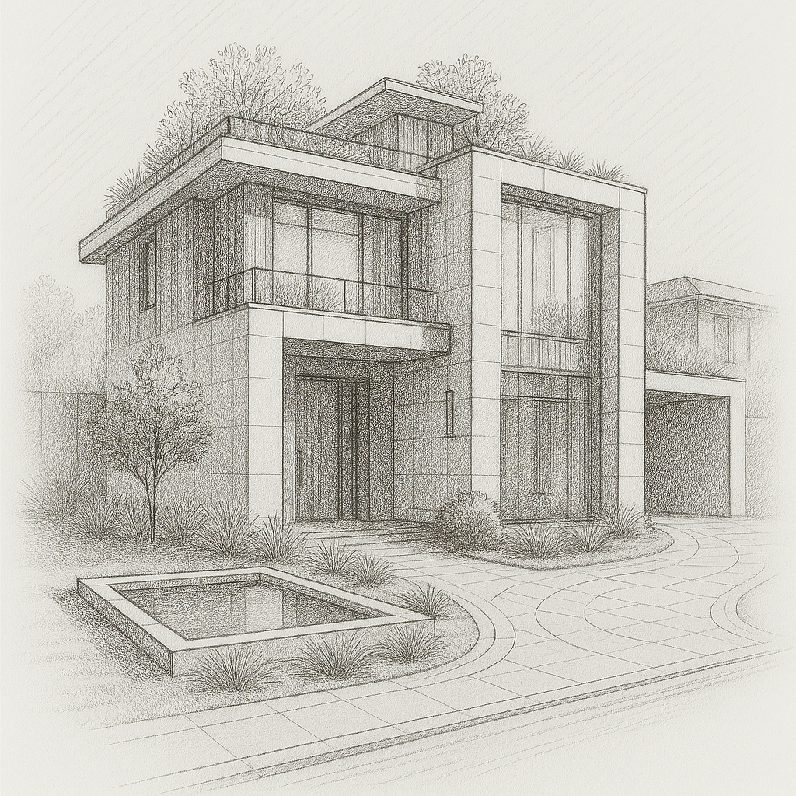
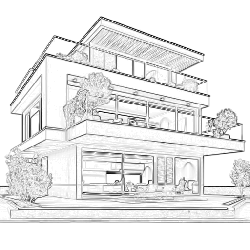
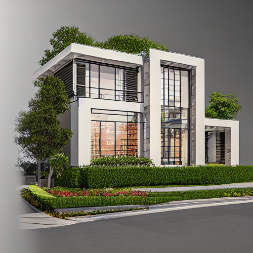
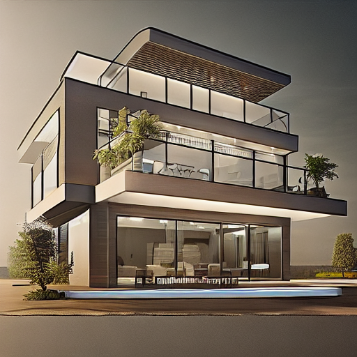

# Architectural ControlNet

## Weights
Model weights can be found here:

https://huggingface.co/aetheres/architectural-controlnet

When running the inference code in controlnet_pipeline.ipynb, change the directory to reflect the location of the weights on your system.

## Process

Stable Diffusion is the choice of model when it comes to photorealistic generation, above GAN models like pix2pix. However, model size is an issue as well as catastrophic forgetting which can be caused when training on small datasets. 

ControlNet allows the training of a set of weights which fine tunes the output of the large Stable Diffusion backbone while keeping all internal weights frozen. This allows the ControlNet model on an RTX 3080 with 10GB of VRAM.

lllyasviel/sd-controlnet-canny was used as the checkpoint to train this architectural model. The sketch input is generated using edge detection which allows the preservation of features such as windows and structural form in the control image passed into ControlNet.

runwayml/stable-diffusion-v1-5 was used as the diffuser in the pipeline.


## Dataset

36 photographic pictures of standalone houses were gathered off Google images which fit the style of the provided sketch. The following processes were used to prepare the images for training:

1. Resizing to fit ControlNet input (512x512)
2. CLAHE to boost contrast. Fine details such as timber facades were being missed in edge detection.
3. Prewitt edge detector was used. Canny caused too much noise in the output. A low threshold was chosen to preserve faint fine details.

## Training

All model weights used for training came from Huggingface as referenced in the Process section. Libraries for environment set up are included in the requirements.txt. Some major libraries used were:

- transformers
- diffusers
- opencv-python
- groundingDINO
- torch
- PIL

## Fine-tuning

The ControlNet model was sensitive to learning rates and batch sizes. A grid search approach was taken with the best hyperparameters found (for 10GB VRAM) to be:

Learning rate: 1e-5\
Batch size: 2\
Grad accumulation: 2

The input prompts for training also had a medium impact on model output. The final prompt was:
```
"photorealistic render, realistic, photograph, outside"
```
Specifying the position was the most important as the diffusion model tended to try generate the inside of a house using the control sketch as the outline of a room.

Adding the type of image improved generation style.

Form was completely controlled by the ControlNet input, prompts had minimal influence.

Due to time limitations, only **3 epochs** were trained.

## Future Work

Grounded SAM shows promise in producing masks for specific features. Windows were an easy feature to extract but it failed at wall material type by segmenting the entire house. CLIPSeg was used for the mask after segmentation. This could form part of the control layer for further training.




CLIPSeg itself is too noisy.




## Demonstration

Hosted on https://www.aetheres.xyz/architectural-controlnet-demo
NOTE: the model requires too much resources to be run real time, the image is pre-loaded.

Sketch style architectural images (bottom is from dataset):




Outputs from model:





You can find out more about me at https://www.aetheres.xyz